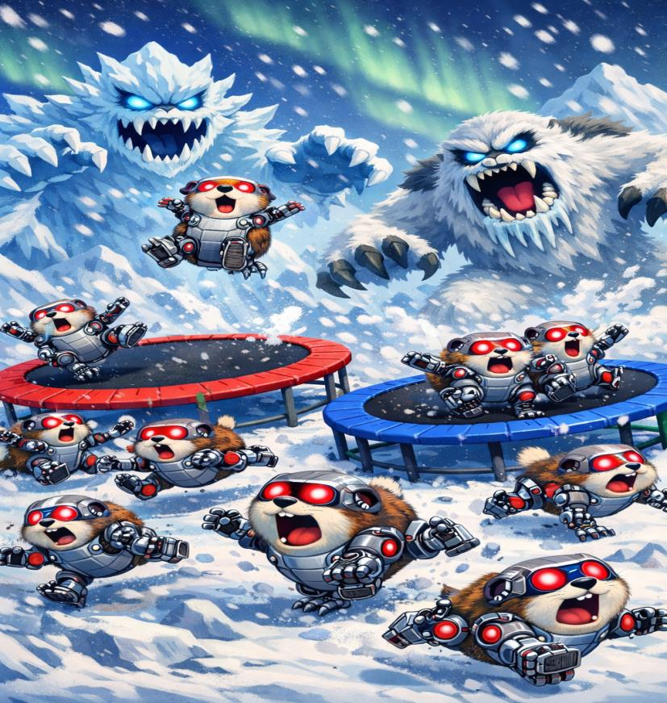

### Lemmings
- Engineered a 2D game engine in C++ using the SFML library, implementing a robust object-oriented hierarchy with multiple levels of inheritance and polymorphism to manage diverse "Actor" entities.
- Architected a centralized game controller to manage real-time object lifecycles and collision detection across a 20*20 coordinate system, utilizing STL containers to ensure efficient memory cleanup and prevent leaks.

  

